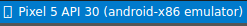

# Fullstack guide for a recomendation system with Flutter

This folder contains the code for [TensorFlow Recommenders](https://www.tensorflow.org/recommenders) + Flutter codelab.

### Pasos 

Paso 0: Ejecute la aplicación de inicio
Abra el archivo en VS Code, asegúrese de que Android Emulator o iOS Simulator estén configurados correctamente y aparezcan en la barra de estado.step0/frontend/lib/main.dart
Por ejemplo, esto es lo que ves cuando usas Pixel 5 con Android Emulator:

Esto es lo que ves cuando usas el iPhone 13 con el simulador de iOS:

Haga clic en  Iniciar depuración.
Nota: En este codelab, se supone que implementas los modelos de recomendación en tu computadora local. Si implementas los modelos en otra máquina remota, cambia la dirección IP o en el código por la de la máquina remota, que ejecuta TensorFlow Serving.10.0.2.2127.0.0.1

Ejecución de la aplicación.

La aplicación debe iniciarse en su emulador de Android o simulador de iOS. La interfaz de usuario es bastante sencilla. Hay un campo de texto que permite al usuario escribir el texto como ID de usuario. La aplicación Flutter enviará la solicitud de consulta al backend, que ejecuta 2 modelos de recomendación y devuelve una lista clasificada de recomendaciones de películas. El frontend mostrará el resultado en la interfaz de usuario después de recibir la respuesta.

**Si hace clic en Recomendar ahora, no sucede nada porque la aplicación aún no puede comunicarse con el back-end.**

**Continua con el Paso 1...(Ruta de acceso)**