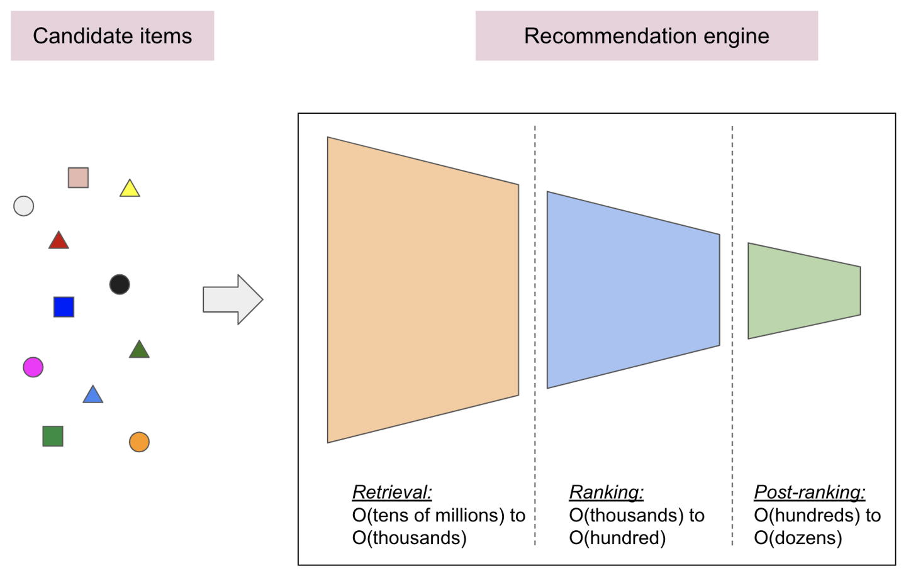

# Fullstack demo of a recommendation engine

Paso 1: Crear los modelos de recuperación y clasificación para el motor de recomendaciones
Los motores de recomendación del mundo real suelen estar compuestos por varias etapas:

La etapa de recuperación es responsable de seleccionar un conjunto inicial de cientos de candidatos de entre todos los posibles candidatos. El objetivo principal de este modelo es eliminar de manera eficiente todos los candidatos que no interesan al usuario. Debido a que el modelo de recuperación puede estar tratando con millones de candidatos, tiene que ser eficiente desde el punto de vista computacional.
La etapa de clasificación toma los resultados del modelo de recuperación y los ajusta para seleccionar el mejor puñado posible de recomendaciones. Su tarea es reducir el conjunto de elementos en los que el usuario puede estar interesado a una lista corta de posibles candidatos del orden de cientos.
La etapa posterior a la clasificación ayuda a garantizar la diversidad, la frescura y la equidad, y reorganiza los elementos candidatos en un conjunto de recomendaciones útiles del orden de docenas.

Para este codelab, entrenarás un modelo de recuperación y un modelo de clasificación con el popular conjunto de datos de MovieLens. Puede abrir el código de entrenamiento a continuación a través de Colab y seguir las instrucciones:

Modelo de recuperación de MovieLens
Modelo de clasificación de MovieLens
Nota: El código de entrenamiento es una adaptación de los tutoriales básicos de recuperación y clasificación básica de TensorFlow Recommenders. Consulte los tutoriales para obtener más información. Además, el vídeo para crear el modelo básico de recuperación y el vídeo para crear el modelo básico de clasificación son referencias útiles.